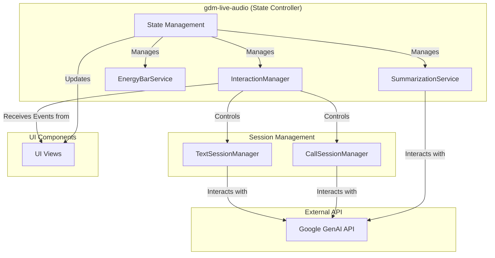

# Technical Design: Unified Interaction Model

### Overview

This document outlines the technical design for the **Unified Interaction Model** feature. The goal is to create a seamless conversational AI experience by integrating a dual-input system (text and voice), a dynamic resource management layer (the "Energy Bar"), and resilient session handling.

The proposed solution involves a component-based architecture primarily on the frontend, managed by a central state controller. It will introduce distinct session managers for text (TTS) and voice (STS) modes, a service to handle energy levels and model tiering, and new UI components for the dynamic layout. This design ensures the solution is modular, maintainable, and provides a robust user experience.

### Architecture

The architecture is centered around a main application component (`gdm-live-audio`) that acts as the primary state controller. It instantiates and coordinates all the necessary services and manages the application's state. Communication between the main component and its services is event-driven, ensuring a loosely coupled and maintainable system.

**Design Rationale:**
This design is based on the findings from the **[research-summary.md](research-summary.md)**, which recommends centralizing the application's interaction logic within an `InteractionManager`. The `gdm-live-audio` component will remain the single source of truth for the application's state, delegating the handling of user interactions and session management to the `InteractionManager`. This approach promotes a clear separation of concerns and enhances the overall maintainability of the codebase.



**Data Flow:**

1.  The `gdm-live-audio` component initializes the `InteractionManager`, `EnergyBarService`, and `SummarizationService`.
2.  User interaction events from the UI (e.g., `send-message`, `start-call`) are dispatched to the `gdm-live-audio` component, which routes them to the `InteractionManager`.
3.  The `InteractionManager` manages the lifecycles of the `TextSessionManager` and `CallSessionManager`, instructing them to start, send data to, or end a session with the Google GenAI API.
4.  The session managers are responsible for all direct communication with the Google GenAI API, including handling session resumption tokens.
5.  If a rate limit is detected, the session manager notifies the `InteractionManager`, which then instructs the `EnergyBarService` to downgrade the energy level for that mode.
6.  The `EnergyBarService` updates the energy state and emits an `energy-level-changed` event. The `gdm-live-audio` component listens for this event and updates its state, which is then reflected in the UI.
7.  At the end of a call, the `InteractionManager` passes the transcript to the `SummarizationService` to generate a summary. The summary is then stored in the application's state and displayed in the call history.

### Components and Interfaces

#### 1. `gdm-live-audio` (Main Component)
*   **Responsibility:** Acts as the central state controller. Initializes and coordinates all services. Manages the overall application state and handles UI updates in response to state changes.
*   **State Properties:**
    *   `activeMode: 'text' | 'call'`
    *   `callState: 'idle' | 'connecting' | 'active' | 'ending'`
    *   `textTranscript: Message[]`
    *   `callTranscript: Message[]`
    *   `callHistory: CallSummary[]`
*   **Event Handling:**
    *   Listens for UI events (e.g., `send-message`, `start-call`) and delegates them to the `InteractionManager`.
    *   Listens for service events (e.g., `energy-level-changed`, `state-update`) and updates its internal state accordingly.

#### 2. `InteractionManager` (Service Class)
*   **Responsibility:** Orchestrates the core interaction logic. Manages the lifecycles of the `TextSessionManager` and `CallSessionManager`, handles UI event processing, and coordinates between the `EnergyBarService` and `SummarizationService`.
*   **Interface:**
    *   `handleEvent(event: CustomEvent): void`
    *   `onRateLimitError(mode: 'tts' | 'sts'): void`

#### 3. `BaseSessionManager` (Abstract Class)
*   **Responsibility:** Provides the core functionality for session management, including session resumption, reconnection logic, and handling of `GoAway` messages.
*   **Interface:**
    *   `startSession(context?: string): Promise<void>`
    *   `endSession(): void`
    *   `setResumptionToken(token: string): void`

#### 4. `TextSessionManager` (Service Class - Extends `BaseSessionManager`)
*   **Responsibility:** Manages text-based (TTS) sessions, including sending and receiving text messages and handling text-specific API configurations.
*   **Interface:**
    *   `sendMessage(text: string): Promise<string>`

#### 5. `CallSessionManager` (Service Class - Extends `BaseSessionManager`)
*   **Responsibility:** Manages voice-based (STS) sessions, including handling real-time audio streaming, bidirectional transcription, and call-specific API configurations.
*   **Interface:**
    *   `sendAudio(chunk: ArrayBuffer): Promise<void>`

#### 6. `EnergyBarService` (Service Class)
*   **Responsibility:** Manages the energy levels for both TTS and STS modes. Determines the correct Gemini model to use based on the current energy level and emits an `energy-level-changed` event when the level is updated.
*   **State Properties:**
    *   `ttsLevel: number` (2, 1, 0)
    *   `stsLevel: number` (3, 2, 1, 0)
*   **Interface:**
    *   `downgrade(mode: 'tts' | 'sts')`
    *   `reset(mode: 'tts' | 'sts')`
    *   `getCurrentModel(mode: 'tts' | 'sts'): string`
    *   `getPersonaPrompt(mode: 'tts' | 'sts'): string`

#### 7. `SummarizationService` (Service Class)
*   **Responsibility:** Generates a summary from a call transcript using a lightweight Gemini model.
*   **Interface:**
    *   `summarize(transcript: Message[]): Promise<string>`

#### 8. UI Components (`<chat-view>`, `<call-transcript>`, etc.)
*   **Responsibility:** Purely presentational components that receive data via properties and emit events for user actions. They do not contain business logic.


### Data Models

#### `Message`
Represents a single entry in a transcript.
```typescript
interface Message {
  id: string;
  sender: 'user' | 'model';
  text: string;
  timestamp: Date;
}
```

#### `CallSummary`
Represents a summarized entry in the call history.
```typescript
interface CallSummary {
  id: string;
  summaryText: string;
  timestamp: Date;
  originalTranscript: Message[];
}
```

#### `SessionState` (In-Memory)
Represents the state of an active session, including the resumption token.
```typescript
interface SessionState {
  sessionId: string;
  resumptionToken: string | null;
  currentModel: string;
}
```

### Error Handling

Errors will be managed at different layers and communicated to the user via UI feedback (e.g., toast notifications, persona prompts).

| Error Type | Layer | Handling Strategy | User Feedback |
|---|---|---|---|
| `RateLimitError` | `SessionManager` | Caught and propagated to `InteractionManager`. | `InteractionManager` triggers `EnergyBarService` downgrade. A persona-specific message is shown in the UI. |
| `InvalidTokenError`| `SessionManager` | Caught during session resumption. A new session is started automatically. | None (transparent to user). |
| `NetworkError` | `SessionManager` | Attempt to reconnect using the in-memory resumption token. | A "Reconnecting..." message is displayed in the relevant UI. |
| `APIKeyError` | `SessionManager` | Fail the request and display an error. | A toast notification: "Invalid API Key. Please check your settings." |
| `SummarizationError`| `SummarizationService` | Log the error. The call history will show the full transcript instead of a summary. | A "Summary unavailable" message in the call history item. |

### Testing Strategy

*   **Unit Tests:**
    *   `EnergyBarService`: Test state transitions (downgrade, reset) and model selection logic.
    *   `InteractionManager`: Mock its dependencies to test the orchestration logic for starting/ending sessions and handling rate limits.
    *   `SummarizationService`: Test the API call logic with mock data.
*   **Integration Tests:**
    *   Test the flow from a user action in `gdm-live-audio` through the `InteractionManager` to the `SessionManager` (with a mocked API).
    *   Verify that a `RateLimitError` correctly triggers the energy downgrade and model change.
*   **End-to-End (E2E) Tests:**
    *   Simulate a full user journey: start the app, send a text message, start a call, encounter a rate limit, end the call, and verify the call summary appears in the history.
    *   This will require a mechanism to mock the Google GenAI API at the network level.
